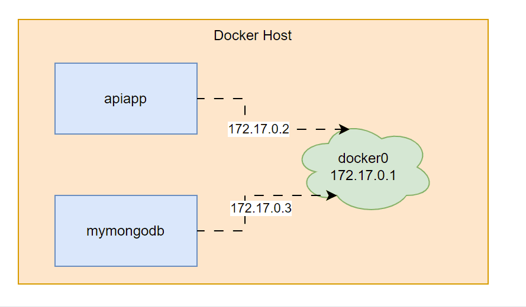
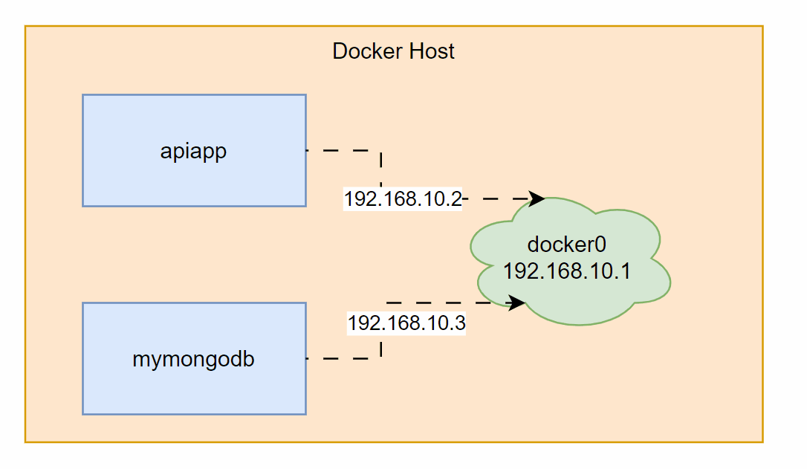
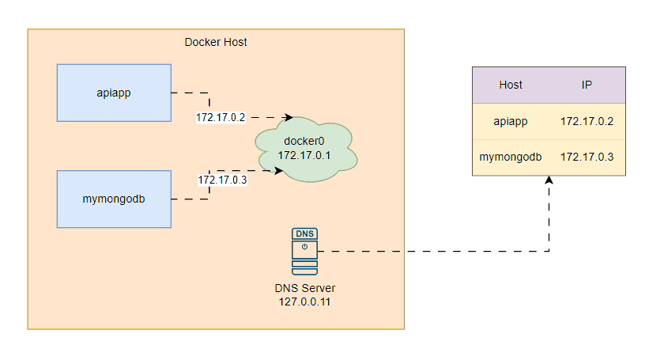

# Network

!!! info
    By default, Docker will **create three networks automatically** after installing Docker successfully.

    - **bridge**
    - **host**
    - **none**

    There are two more network types;

    - **overlay** - Multiple Docker Daemon hosts (Docker running on different machines) are able to connect with each other.
    - **macvlan** - Set a custom MAC address to a container, this address can then be used for communication with that container.

## Network types

### None

**No network** is **attached** to the containers, and they have no access to any external network or other containers. As they run in an isolated network, there is no IP configuration for the containers.

```bash
docker run --network=none ubuntu
```

### Host (local)

!!! info
    container port 80 = host port 80

The host network driver **removes the network isolation** between the **Docker host** and the **Docker containers** to use the **host's networking** directly. Therefore, the container **won't get its own IP address**.

For instance, if you run a container which binds to port 80, the container's application will be available on port 80 on the host's IP address (localhost, IP). Therefore, you no need to specify `-p 80:80` for host networking, as that option is only for bridge network.

```bash
docker run --network=host apiapp
```

### Bridge



!!! info
    **docker0 (172.17.0.1)** is the **bridge** network, so all the bridge network will need to go through **docker0** bridge (use `ip addr` to see more details)

By default, the bridge driver network is **attached** to all container.

```bash
docker run ubuntu # it uses Bridge network by default
```

Docker creates a **private internal network** called the bridge network on the host. The bridge network is **attached** to all containers by default and will get an **internal IP address**, normally in the `172.17` series range. Therefore, the containers can access each other using this internal IP.

Additional information;

- Containers connected to the **same bridge network can communicate** using a software bridge while remaining **isolated** from containers **not connected** to it.
- Containers can **find each other by name** in the same network instead of using an IP address.
- It provides better **isolation** and **interoperability** between containerized applications.
- Environment variables are **shared** between linked containers on the bridge network.

#### User-defined bridge network



You can **create** your **own internal network**.

```bash
docker network create --driver bridge --subnet 192.168.10.0/24 mynewinternalnetwork
```

With this setup, it will create a network with IP range of `192.168.10.0/24`. (192.168.10.1-192.168.10.254)

## List neworks

```bash
docker network ls
```

## Inspect networks

```bash
docker network inspect <network-name>
```

## Remove network

```bash
docker network rm <network-name>
docker network prune
```

## Connect/Disconnect container to network

```bash
docker network connect <network-name> <container>
docker network disconnect <network-name> <container>
```

## Container Communication

### Container to host (local) communication

If you want your container to communicate with the host, you have to replace the container's **localhost** or **IP address** to **host.docker.internal**. This domain will translate to the IP address of your localhost machine as seen from inside the Docker container.

For example, now you have a Python API application that links to mongoDB. Here is the endpoint `mongodb://localhost:27017/user`. So, you have to change to `mongodb://host.docker.internal:27017/user`.

### Container to container communication

There are two methods to let a container communicate with another container.

- Method 1 (not recommended)
    - Use `docker inspect <container>` to get the container IP address, then within your application code, put that specific IP address into it `mongodb://172.17.0.3:27017/user`
- Method 2
    - Use the container name as the input `mongodb://mymongodb:27017/user`
    - The container name refers to its IP address allocated by **docker0**.
    - 
