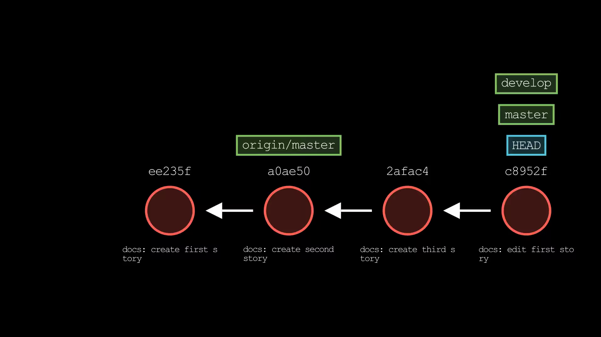
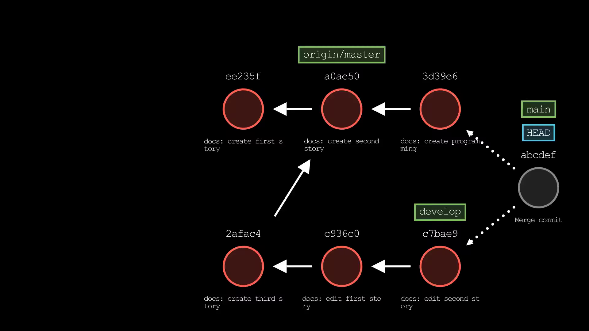
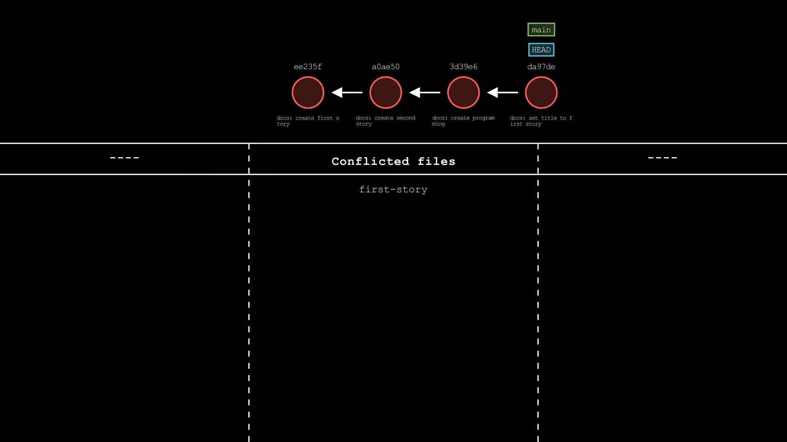

# Branches

## What is Git Branch?

!!! info
    Default branch will be created either **master** or **main** depends on the settings.

Branch is an **independent line of development work**. As an example, if you are working on a large project and you want to add a new feature, you can't commit all your changes straight away and push them to the default branch, since that would make the commit history pretty messy and it would be hard to tell which changes were made.

**Regardless of how big or small your changes are, always create a branch and work on it to encapsulate your changes.**

All new commits you make to that branch will be recorded in that branch as well.

## Git branch commands

### Create branch

```mermaid
---
config:
  logLevel: 'debug'
  theme: 'default'
  themeVariables:
      'git0': '#ff0000'
      'git1': '#ff00ff'
      'git2': '#00ffff'
      'git3': '#ffff00'
      'git4': '#ff00ff'
      'git5': '#00ffff'
---
gitGraph
	commit id: "docs: create first story"
	commit id: "docs: create second story"
    commit id: "docs: create third story"
    branch develop
    checkout develop
    commit
```

```bash
git branch <branch-name>
```



### Checkout/Switch branch

!!! info
    Remember that the **HEAD** is Git's way of referring to the current snapshot

Once we have created the branch, we have to **switch** or **checkout** to that branch.

```mermaid
---
config:
  logLevel: 'debug'
  theme: 'default'
  themeVariables:
      'git0': '#ff0000'
      'git1': '#ff00ff'
      'git2': '#00ffff'
      'git3': '#ffff00'
      'git4': '#ff00ff'
      'git5': '#00ffff'
---
gitGraph
	commit id: "docs: create first story"
	commit id: "docs: create second story"
    commit id: "docs: create third story"
    branch develop
    checkout develop
    commit id: "docs: edit first story"
    commit id: "docs: edit second story"
```

- the default branch can still **proceed** with the commits even though we have checkout to **develop** branch

```bash
git checkout <branch-name>
# if the branch name is not exists, it will auto create and checkout to that branch
git checkout -b <branch-name>
```


[Watch animation](../../assets/git/git-sim-checkout.webm)

### Merge branch (Fast-forward)

The `git merge` command will combine two branches, so it will **consolidate** multiple commit sequences into a single history.

Here is the scenario, since **develop** branch came directly from **main** and no other changes had been made to main, so it can fast-forward.

```mermaid
---
config:
  logLevel: 'debug'
  theme: 'default'
  themeVariables:
      'git0': '#ff0000'
      'git1': '#ff00ff'
      'git2': '#00ffff'
      'git3': '#ffff00'
      'git4': '#ff00ff'
      'git5': '#00ffff'
---
gitGraph
	commit id: "docs: create first story"
	commit id: "docs: create second story"
	branch develop
	checkout develop
	commit id: "docs: edit first story"
    commit id: "docs: edit second story"
	checkout main
    commit id: "docs: create programming"
	merge develop
```

```bash
git merge <branch>

# example, if you want to merge develop branch to main
git checkout main
git merge develop
```



[Watch animation](../../assets/git/git-sim-merge.webm)

#### Merge conflicts

A merge conflict will arise when two developers have changed the same lines in a file. Because of that, Git does not know which one is correct.

```mermaid
---
config:
  logLevel: 'debug'
  theme: 'default'
  themeVariables:
      'git0': '#ff0000'
      'git1': '#ff00ff'
      'git2': '#00ffff'
      'git3': '#ffff00'
      'git4': '#ff00ff'
      'git5': '#00ffff'
---
gitGraph
	commit id: "docs: create first story"
    commit id: "docs: create second story"
	branch develop
    checkout develop
	commit id: "docs: edit first story"
    commit id: "docs: edit second story"
	checkout main
    commit id: "docs: create programming"
	commit id: "docs: set title to first story"
	merge develop
    commit id: "merged with develop after fixing conflicts"
```

To resolve merge conflict, you have to open the file to make necessary changes. Then, use `git add` command to stage the new merged commit and the final step is to merge your latest commits into it.

```bash
git add <file-that-has-conflicts>
git commit -m "merged with <branch> after fixing conflicts"
```



### List branches

```bash
git branch
git branch -a # list all local and remote branches
```

### Delete branch

```bash
git branch -d <branch-name> # delete branch with safe operation
git branch -D <branch-name> # force delete branch
```

### Rename branch

```bash
git branch -m <branch-name> <new-branch-name>
git branch -M <branch-name> <new-branch-name> # force rename branch
```

### Create remote branches and push

Before we want to push our local branches to our remote repository. The remote repository needs to be added to our local project if it hasn't already been. Normally the remote name is **origin**, but you can change it.

```bash
git remote add <remote-name> <remote-repo-url>
# example
git remote add origin https://github.com/KarChunT/git-training
```

Once you initialize, you have access to this remote repository. So you can **push** your local branch to the remote at **remote name**.

- The reason why we need to set-upstream from local to remote is because it makes our jobs easier when we want to perform **push** and **pull** operation. With an upstream branch set, you can simply `git pull` or `git push` instead of `git push origin <branch>`

!!! info "What is upstream?"
        
    An upstream is just a **remote tracking branch** that is **associated** with your **local branch**. Do take note that, **each branch only has one upstream**.

```bash
# set-upstream, push the local branch to the remote at remote name
git push -u <remote-name> <local-branch-name>
git push <branch-name> # after you set up-stream, branch-name is optional
git push --force # force push, will overwrite the things in remote

# example
git push -u origin develop
```

You can use the following command:

- if the remote branch already **exists** or
- you want to **change** upstream branch

```bash
git branch -u origin/<branch-name>
```
