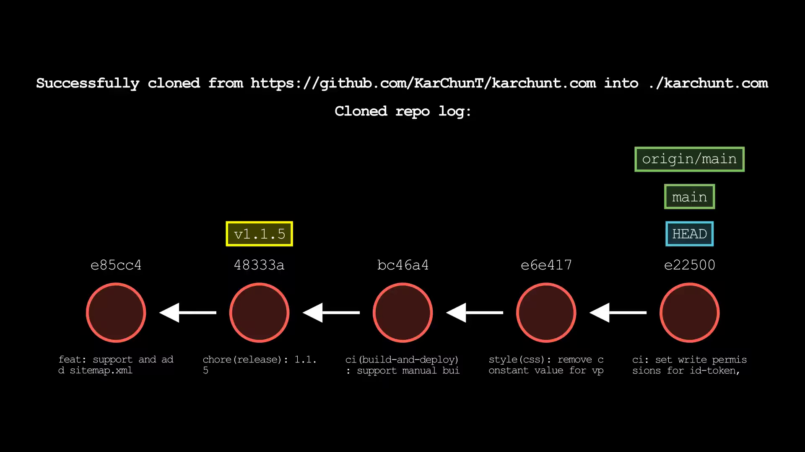

# Setup repository

## Initialize a new Git repo

To create a repo, you will use the `git init` command to initialize a new git repository. Do take note that `git init` is just a **one-time command process**. You will only use it when you want to initialize a new Git repo.

1. Create a folder

      ```bash
      mkdir project
      cd project
      ```

2. Initialize a Git repository
      ```bash
      git init
      git init <directory> # initialize/point to an existing directory
      ```
      - As a result, Git knows that the folder you initiated it on should be monitored.
      - It will also create a hidden folder named `.git/` to keep track of all the changes you made.

## Clone an existing repo

If your project already been setup on centralized server like GitHub, Bitbucket, etc. Then you have to clone that remote repository to your local. Do take note that `git clone` is also just a **one-time command process**. You will only use it when you want to clone an existing repository.

```bash
git clone <repo_url>
git clone https://github.com/KarChunT/karchunt.com
```



### Clone to a specific folder

```bash
git clone <repo_url> <directory>
git clone https://github.com/KarChunT/karchunt.com karchunt
```

### Clone a specific branch

```bash
git clone --branch <branch> <repo_url>
git clone --branch development https://github.com/KarChunT/karchunt.com
```
