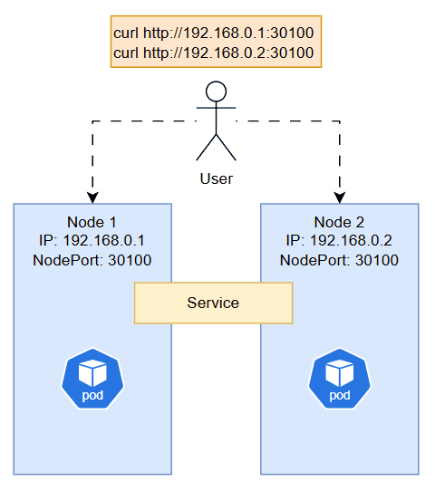

# Services

## Services Introduction

Service is used to **connect applications together** by **exposing** a network application (Pod) in the **cluster**.

The **internal Pod network** is in the **range** of **10.244.0.0**.

- You can use `kubectl describe pods/<pod-name>` to get the pod **IP address**.

---
Kubernetes has default services types:

- ClusterIP
    - This service type will create a **virtual IP address** from a pool of your cluster IP addresses has reserved and **assign** it to a pod for **enabling the communication** between **different services** within a Kubernetes cluster.
- NodePort
    - This service type will **expose** an application to **external clients** by **opening** an **internal port** on the **worker nodes** in Kubernetes cluster.
- LoadBalancer
    - This service type can support **external load balancers** and it will **provision a load balancer** for your application services, mainly to **distribute the network traffic/load** across multiple instances of an application in Kubernetes cluster.

## Services Types

### ClusterIP (Internally)

```mermaid
flowchart
    pod1[Pod1 10.244.0.1]
    pod2[Pod2 10.244.0.2]
    pod3[Pod3 10.244.0.3]
```

Here is the diagram, each **pod** has its **own IP address**, however, these IP addresses are **not static**, as pods can go down or **restart** at any time, then new pods are created, and new IP addresses are assigned. Thus, these IP addresses **cannot be used to communicate internally** between applications.

So with the help of **ClusterIP**, each service will be **assigned** with a **name** and an **IP address** inside the cluster and the **other pods** can use either one **(Service name/Cluster IP address)** to **access** the **service**. This is the default type of service.

```mermaid
flowchart
  pod[pod port 8080]
  service[service port 8000] --> pod
```

```yaml title="service.yaml"
apiVersion: v1
kind: Service
metadata:
  name: backend-service
spec:
  selector:
    app: backend
  type: ClusterIP
  ports:
    - targetPort: 8080 # The port that Pod exposes
      port: 8000 # Service Port
```

### NodePort

```mermaid
flowchart
  NodePort[NodePort port 30121] --> Service
  Service[Service port 8000] --> Pod
  Pod[Pod port 8080]
```

NodePort is actually **mapping a internal port on the node** to a port that the **pod exposes via Service**. The port on the node is used to **access** or **expose** the application **externally**.

```yaml title="service.yaml"
apiVersion: v1
kind: Service
metadata:
  name: backend-service
spec:
  selector:
    app: backend
  type: NodePort
  ports:
    - targetPort: 8080 # The port that Pod exposes
      port: 8000 # Service Port
      nodePort: 30121 # valid range from 30000-32767
```

- You can specify a `nodePort`, but if you don't specify one, the system will **automatically assign** one in the range **30000-32767**.

```bash
# Use cluster-info to get your IP address
kubectl cluster-info

# public node IP = Public IP address of the node
curl http://<public-node-ip>:<node-port>
curl http://192.168.1.5:30121

# For my case is Podman
curl http://kind-cluster-control-plane:30121
```


#### More explanation

!!! question "What happens if the pods have the same label within the same node?"
    Assuming that the service **finds five pods with the same label**, then it will **pick all five pods as the endpoints** for **external requests**. Another thing is it will use a **random algorithm** to **distribute the network traffic/load** across **multiple instances** of an application.

!!! question "What happen when the pods are distributed across multiple nodes?"
    

    Kubernetes will **automatically create a service** that **spans all the nodes** and **maps its targetPort to each nodePort** on all the nodes in the cluster. Thus, the application can be accessed by using the **node IP** and the **same nodePort number** in the cluster.

    In addition, if you have **three nodes** and your pods have just been **deployed on two of them**, they **will still be accessed on all the nodes** in the cluster and this is how the service is configured in Kubernetes.

### Load Balancer

[Reference](https://kubernetes.io/docs/concepts/services-networking/service/#loadbalancer)

We know that the **NodePort url** is something like this `http://<public-node-ip>:<node-port>`, but this is **not feasible** and **user-friendly** for the user to **access the application**. So, we would need to create a **DNS name** that actually **map the portion** of this `<public-node-ip>:<node-port>`. In this case, we have multiple ways to achieve it.

- We can **create a new VM, install, and configure a suitable load balancer** like Nginx, HAProxy, etc. Then, we will have to configure the load balancer to route** the traffic to the underlying nodes**. But manually setting all these process can be a pain and it is very hard to maintain.

- Therefore, Kubernetes **actually supported some of the cloud platforms** like AWS, Google Cloud, Azure, etc. We can **leverage and integrate** the native load balancer from there. So you no need to configure and maintain the load balancer. What you need to do is just **replace** `type: NodePort` to `type: LoadBalancer`, and it will have the same effect as `NodePort` to **distribute or balance the network load/traffic**.

```mermaid
graph TD
  A[External Client] -->|HTTP/HTTPS Request| B[Ingress]
  B --Send Request--> Z["Load Balancer (GCP, AWS, Azure)"]
  Z -->|Route 1: Host/Path A| C[Service A]
  Z -->|Route 2: Host/Path B| D[Service B]
  Z -->|Route 3: Host/Path C| E[Service C]
  C -->|Forwards Traffic| F[Pod A1, Pod A2]
  D -->|Forwards Traffic| G[Pod B1, Pod B2]
  E -->|Forwards Traffic| H[Pod C1, Pod C2]
```

Kubernetes will send a request to the **cloud provider** to create/provision/deploy a **load balancer** for the service and assign a **public IP address** to the load balancer. The load balancer will then route the traffic to the **service** and then to the **pod**.
