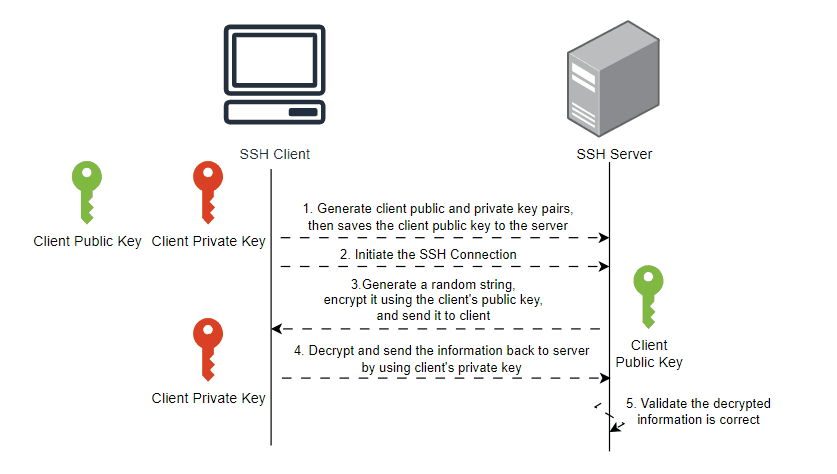

# SSH Overview

## What is SSH?

SSH stands for **Secure Shell (SSH) Protocol** that is mainly used to **connect** to a Linux server remotely. Basically, it gives you the opportunity to access a server/computer over an unsecured network.

## How SSH Works?

**Client-server architecture** is used to implement SSH connections. The remote machine (**Server**) must be running **SSH daemon** (The heart of SSH). In SSH, a specific network port (**22**) is used for connection requests, authentication, and login into shell sessions when the user provides the correct credentials.

## How SSH Authenticate Users?
  
We can use **passwords** or **SSH keys** to authenticate the right users to login.

### Password

It is **not recommended** to use passwords to log in, as when the malicious users or bots will keep repeatedly trying to authenticate their accounts, it might potentially lead to **security compromises** although password logins are encrypted. Therefore, it is **less secure** compared to **SSH Keys**.

### SSH Keys

The SSH keys consist of both **public and private cryptographic keys**. For the public key, the user can share with anyone freely without any concerns, while the private key must be stored in a secure way and cannot be exposed to anyone.

**Steps to authenticate;**

1. The clients must have an **SSH key pair (public and private)** on their local computers.
2. The local client's **public key** must be **copied** to the user's home directory at `~/.ssh/authorized_keys` on the remote server.
3. When the client connects to the host/server, it will inform the server which public key to use to authenticate.
4. The server will validate the public key from `~/.ssh/authorized_keys` file, if it is valid, then it will generate a random string and encrypt it using the public key.
5. The server will send the encrypted message to the client to test whether the client has the associated private key.
6. After receiving an encrypted message from the server, the client will use the **client's private key** to decrypt and send the decrypted information back to the server.
7. Lastly,the client is able to log into shell sessions when the server determines that the client has the associated private key by validating the decrypted information is correct.